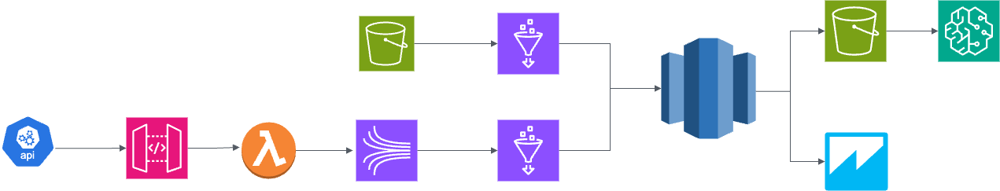

# Real-time Genomics and Healthcare Data Integration

## Overview

This project enhances a genomic data processing pipeline by integrating transactional healthcare data via REST APIs from hospitals. It utilizes various AWS services for real-time ingestion, transformation, storage, and analytics, focusing on merging genomic and healthcare data for predictive analytics and patient outcome insights.

### Tech Stack

- **AWS S3**: Storage for genomic and healthcare data.
- **AWS Glue**: ETL for merging and transforming data.
- **Amazon Redshift**: Data warehousing for processed data.
- **Amazon API Gateway**: Ingest healthcare transactional data via REST APIs.
- **Amazon Kinesis**: Real-time streaming of genomic and healthcare data.
- **AWS Lambda**: Serverless compute for processing data.
- **Amazon QuickSight**: Visualization of processed data.
- **AWS Step Functions**: Orchestration of workflows.
- **AWS SageMaker**: Predictive analytics and machine learning on patient outcomes.

## Architecture

Below is the high-level architecture flow for the project.

## Project Structure

1. **Data Ingestion**
   - Genomic data from sequencing labs (e.g., BAM files) is uploaded to AWS S3.
   - Healthcare transactional data (e.g., patient records, insurance claims) is ingested in real-time via REST APIs using AWS API Gateway.
   - API Gateway integrates with AWS Lambda to stream data into Kinesis.

2. **Real-time Data Streaming**
   - Amazon Kinesis is used to stream both genomic metadata and healthcare data in real-time.
   - Kinesis streams the data into AWS Glue Streaming jobs for real-time ETL.

3. **Data Processing**
   - AWS Glue merges, cleanses, and transforms the genomic and healthcare data.
   - Glue Crawlers catalog data stored in S3, making it available for further analysis.

4. **Data Storage**
   - Processed data is stored in Amazon Redshift for structured querying and analytics.

5. **Real-time Analytics and ML**
   - Analytics on patient outcomes based on combined genomic and healthcare data is performed using Amazon Redshift.
   - Predictive models are built using AWS SageMaker to forecast patient health risks.

6. **Visualization**
   - Data is visualized using Amazon QuickSight, showing trends, patient outcomes, and health risk predictions.
